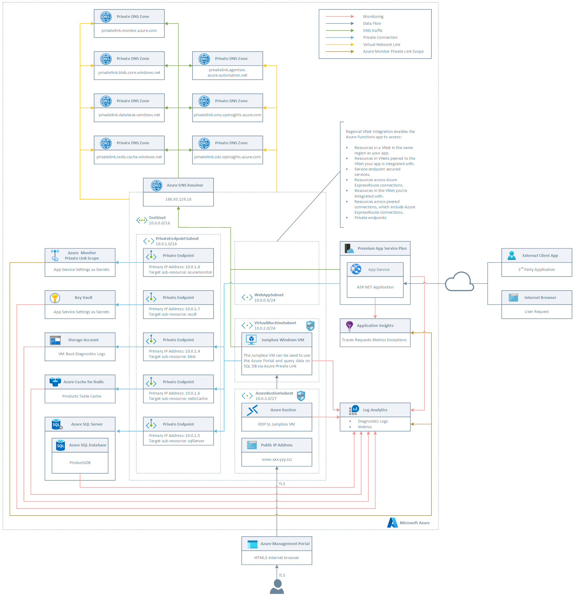
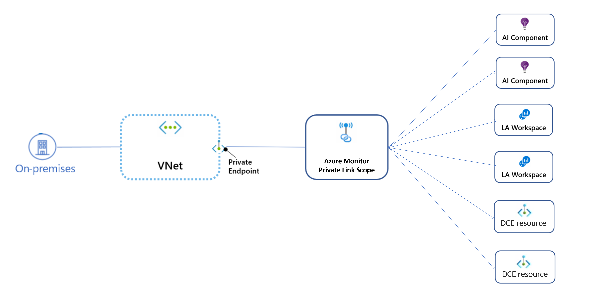
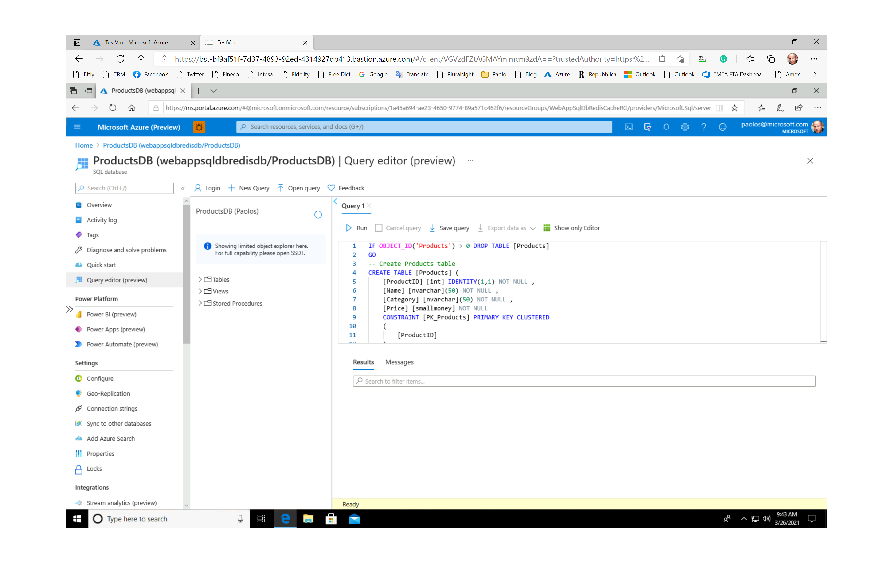
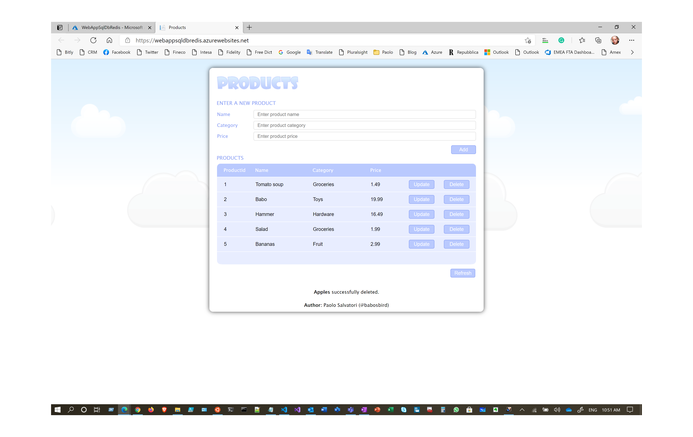

# How to configure Azure Monitor Private Link Scope (AMPLS)

This sample shows how to create and configure an [Azure Monitor Private Link Scope (AMPLS)](https://docs.microsoft.com/en-us/azure/azure-monitor/logs/private-link-security) to let an [Azure App Service](https://docs.microsoft.com/en-us/azure/app-service/overview) with [Regional VNET Integration](https://docs.microsoft.com/en-us/azure/app-service/web-sites-integrate-with-vnet#regional-vnet-integration) to connect privately to [Azure Monitor](https://docs.microsoft.com/en-us/azure/azure-monitor/overview), and in particular to [Azure Log Analytics](https://docs.microsoft.com/en-us/azure/azure-monitor/logs/log-analytics-overview) and [Azure Application Insights](https://docs.microsoft.com/en-us/azure/azure-monitor/app/app-insights-overview) resources, without opening up any public network access. This sample also shows how to deploy an infrastructure and network topology on Azure where an ASP.NET Core web application hosted by an [Azure App Service](https://docs.microsoft.com/en-us/azure/app-service/) accesses data from [Azure Cache for Redis](https://docs.microsoft.com/en-us/azure/azure-cache-for-redis/cache-overview) and [Azure SQL Database](https://docs.microsoft.com/en-us/azure/azure-sql/database/sql-database-paas-overview) using [Azure Private Endpoints](https://docs.microsoft.com/azure/private-link/private-endpoint-overview). The Azure Web App is hosted in a [Standard, Premium, PremiumV2, PremiumV3](https://docs.microsoft.com/en-us/azure/app-service/overview-hosting-plans) with [Regional VNET Integration](https://docs.microsoft.com/en-us/azure/app-service/web-sites-integrate-with-vnet#regional-vnet-integration).
[Azure Private Link for Azure Cache for Redis](https://docs.microsoft.com/en-us/azure/azure-cache-for-redis/cache-private-link) provides private connectivity from a virtual network to a customers’ cache instance. It simplifies the network architecture and secures the connection between endpoints in Azure by eliminating data exposure to the public internet. Private Link carries traffic privately, reducing a customer’s exposure to threats and helps to meet their compliance standards.Private endpoints are fully supported also by the Standard tier of [Azure Cache for Redis](https://docs.microsoft.com/en-us/azure/azure-cache-for-redis/cache-private-link). However, to use private endpoints, an [Azure Cache for Redis](https://docs.microsoft.com/en-us/azure/azure-cache-for-redis/cache-overview) instance needs to have been created after July 28th, 2020. Currently, zone redundancy, portal console support, and persistence to firewall storage accounts are not supported.

This sample also shows  how to:

- Use a [system-assigned managed identity](https://docs.microsoft.com/en-us/azure/azure-app-configuration/howto-integrate-azure-managed-service-identity?tabs=core2x) to let the Web App access secrets from [Azure Key Vault](https://docs.microsoft.com/en-us/azure/key-vault/general/overview)
- Deploy an ASP.NET Core application to an Azure App Service using a GitHub Actions workflow
- Disable the public network access from the internet to all the managed services used by the application:

  - [Azure Blob Storage Account](https://docs.microsoft.com/en-us/azure/storage/common/storage-account-overview)
  - [Azure Key Vault](https://docs.microsoft.com/en-us/azure/key-vault/general/overview)
  - [Azure Cache for Redis](https://docs.microsoft.com/en-us/azure/azure-cache-for-redis/cache-overview)
  - [Azure Log Analytics](https://docs.microsoft.com/en-us/azure/azure-monitor/logs/log-analytics-overview)
  - [Azure SQL Database](https://docs.microsoft.com/en-us/azure/key-vault/general/overview)
  - [Azure Application Insights](https://docs.microsoft.com/en-us/azure/azure-monitor/app/app-insights-overview)

For more information, see:

- [Azure Private Link for Azure SQL Database and Azure Synapse Analytics](https://docs.microsoft.com/en-us/azure/azure-sql/database/private-endpoint-overview)
- [Web app private connectivity to Azure SQL database](https://docs.microsoft.com/en-us/azure/architecture/example-scenario/private-web-app/private-web-app)
- [Azure Cache for Redis with Azure Private Link](https://docs.microsoft.com/en-us/azure/azure-cache-for-redis/cache-private-link)
- [Configure virtual network support for a Premium Azure Cache for Redis instance](https://docs.microsoft.com/en-us/azure/azure-cache-for-redis/cache-how-to-premium-vnet)

In addition, Azure Web Apps can be configured to be called via a private IP address by applications located in the same virtual network, or in a peered network, or on-premises via ExpressRoute or a S2S VPN. For more information, see:

- [Using Private Endpoints for Azure Web App](https://docs.microsoft.com/en-us/azure/app-service/networking/private-endpoint).
- [Create an App Service app and deploy a private endpoint by using an Azure Resource Manager template](https://docs.microsoft.com/en-us/azure/app-service/scripts/template-deploy-private-endpoint).

## Architecture

The following picture shows the architecture and network topology of an architecture where an [Azure App Service](https://docs.microsoft.com/en-us/azure/app-service/overview) with [Regional VNET Integration](https://docs.microsoft.com/en-us/azure/app-service/web-sites-integrate-with-vnet#regional-vnet-integration) connects privately to [Azure Log Analytics](https://docs.microsoft.com/en-us/azure/azure-monitor/logs/log-analytics-overview) and [Azure Application Insights](https://docs.microsoft.com/en-us/azure/azure-monitor/app/app-insights-overview) using an [Azure Monitor Private Link Scope (AMPLS)](https://docs.microsoft.com/en-us/azure/azure-monitor/logs/private-link-security) and accesses privately an [Azure Cache for Redis](https://docs.microsoft.com/en-us/azure/azure-cache-for-redis/cache-overview), an [Azure Blob Storage Account](https://docs.microsoft.com/en-us/azure/storage/common/storage-account-overview), an [Azure Key Vault](https://docs.microsoft.com/en-us/azure/key-vault/general/overview), and an [Azure SQL Database](https://docs.microsoft.com/en-us/azure/key-vault/general/overview) using [Azure Private Endpoints](https://docs.microsoft.com/azure/private-link/private-endpoint-overview).



The ARM template deploys the following resources:

- Virtual Network: this virtual network is composed of the following subnets:
  - **WebAppSubnet**: this subnet is used for the regional VNET integration with the Azure Web App app hosted by a Premium Plan. For more information, see [Using Private Endpoints for Azure Web App](https://docs.microsoft.com/en-us/azure/app-service/networking/private-endpoint).
  - **PrivateEndpointSubnet**: hosts the private endpoints used by the application.
  - **VirtualMachineSubnet**: hosts the jumpbox virtual machine and any additional virtual machine used by the solution.
  - **AzureBastionSubnet**: hosts Azure Bastion. For more information, see [Working with NSG access and Azure Bastion](https://docs.microsoft.com/en-us/azure/bastion/bastion-nsg).
- Network Security Group: this resource contains an inbound rule to allow access to the jumpbox virtual machine on port 3389 (RDP)
- A Windows 10 virtual machine. This virtual machine can be used as jumpbox virtual machine to simulate a real application and send requests to the Azure Web Apps exposed via [Azure Private Link](https://docs.microsoft.com/en-us/azure/private-link/private-link-overview).
- A Public IP for Azure Bastion
- Azure Bastion is used to access the jumpbox virtual machine from the Azure Portal via RDP. For more information, see [What is Azure Bastion?](https://docs.microsoft.com/en-us/azure/bastion/bastion-overview).
- An ADLS Gen 2 storage account used to store the boot diagnostics logs of the virtual machine as blobs
- A [Standard, Premium, PremiumV2, PremiumV3](https://docs.microsoft.com/en-us/azure/app-service/overview-hosting-plans) hosting plan that supports [Regional VNET Integration](https://docs.microsoft.com/en-us/azure/app-service/web-sites-integrate-with-vnet#regional-vnet-integration)
- An Azure App Service containing an ASP.NET Core application that uses a system-assigned managed identity to read settings from Key vault. The web site is a single page application that stores data in [Azure SQL Database](https://docs.microsoft.com/en-us/azure/azure-sql/database/sql-database-paas-overview) and caches items in [Azure Cache for Redis](https://docs.microsoft.com/en-us/azure/azure-cache-for-redis/cache-overview).
- An Application Insights resource used by the Azure Web Apps app to store logs, traces, requests, exceptions, and metrics. For more information, see [Web application monitoring on Azure](https://docs.microsoft.com/en-us/azure/architecture/reference-architectures/app-service-web-app/app-monitoring).
- An Azure SQL Server and [Azure SQL Database](https://docs.microsoft.com/en-us/azure/azure-sql/database/sql-database-paas-overview) hosting the ProductDB relational database used by the Web App.
- An [Azure Key Vault](https://docs.microsoft.com/en-us/azure/key-vault/general/overview) used to store the following application settings. These settings are automtically created by the ARM template as secrets in [Azure Key Vault](https://docs.microsoft.com/en-us/azure/key-vault/general/overview):

  - [Azure Cache for Redis](https://docs.microsoft.com/en-us/azure/azure-cache-for-redis/cache-overview) connection string
  - [Azure SQL Database](https://docs.microsoft.com/en-us/azure/key-vault/general/overview) connection string
  - [Azure Application Insights](https://docs.microsoft.com/en-us/azure/azure-monitor/app/app-insights-overview) Instrumentation Key

- A private endpoint to the:

  - [Azure Monitor Private Link Scope (AMPLS)](https://docs.microsoft.com/en-us/azure/azure-monitor/logs/private-link-security)
  - [Azure Blob Storage Account](https://docs.microsoft.com/en-us/azure/storage/common/storage-account-overview) (boot diagnostics logs)
  - [Azure Cache for Redis](https://docs.microsoft.com/en-us/azure/azure-cache-for-redis/cache-overview)
  - [Azure SQL Database](https://docs.microsoft.com/en-us/azure/key-vault/general/overview)
  - [Azure Key Vault](https://docs.microsoft.com/en-us/azure/key-vault/general/overview)

- A Private DNS Zone Group to link each private endpoint with the corresponding Private DNS Zone.
- The NIC used by the jumpbox virtual machine and for each private endpoint.
- A Log Analytics workspace used to monitor the health status of the services such as the hosting plan or NSG.
- A Private DNS Zone for [Azure Blob Storage Account](https://docs.microsoft.com/en-us/azure/storage/common/storage-account-overview) private endpoint (privatelink.blob.core.windows.net)
- A Private DNS Zone for [Azure Cache for Redis](https://docs.microsoft.com/en-us/azure/azure-cache-for-redis/cache-overview) private endpoint (privatelink.redis.cache.windows.net)
- A Private DNS Zone for [Azure SQL Database](https://docs.microsoft.com/en-us/azure/key-vault/general/overview) private endpoint (privatelink.database.windows.net)
- A Private DNS Zone for [Azure Key Vault](https://docs.microsoft.com/en-us/azure/key-vault/general/overview) private endpoint (privatelink.vaultcore.azure.net)
- A Private DNS Zone for [Azure Monitor](https://docs.microsoft.com/en-us/azure/azure-monitor/overview) private endpoint (privatelink.monitor.azure.com)
- A Private DNS Zone for privatelink-oms-opinsights-azure-com zone
- A Private DNS Zone for privatelink-ods-opinsights-azure-com zone
- A Private DNS Zone for privatelink-agentsvc-azure-automation-net zone

## Azure Monitor Private Link Scope

Azure Monitor Private Link Scope connects a Private Endpoint to a set of Azure Monitor resources as [Azure Log Analytics](https://docs.microsoft.com/en-us/azure/azure-monitor/logs/log-analytics-overview) and [Azure Application Insights](https://docs.microsoft.com/en-us/azure/azure-monitor/app/app-insights-overview) resources as shown in the following picture:



Azure Monitor Private Link Scope provides the following advantages:

- Connect privately to Azure Monitor without opening up any public network access
- Ensure your monitoring data is only accessed through authorized private networks
- Prevent data exfiltration from your private networks by defining specific Azure Monitor resources that connect through your private endpoint
- Securely connect your private on-premises network to Azure Monitor using ExpressRoute and Private Link
- Keep all traffic inside the Microsoft Azure backbone network

For more information on [Azure Monitor Private Link Scope (AMPLS)](https://docs.microsoft.com/en-us/azure/azure-monitor/logs/private-link-security) see:

- [Use Azure Private Link to connect networks to Azure Monitor](https://docs.microsoft.com/en-us/azure/azure-monitor/logs/private-link-security)
- [Design your Private Link setup](https://docs.microsoft.com/en-us/azure/azure-monitor/logs/private-link-design)
- [Configure your Private Link](https://docs.microsoft.com/en-us/azure/azure-monitor/logs/private-link-configure)

## Important Notes

The ARM template disables the public access to both [Azure SQL Database](https://docs.microsoft.com/en-us/azure/key-vault/general/overview) and [Azure Cache for Redis](https://docs.microsoft.com/en-us/azure/azure-cache-for-redis/cache-overview) via the `publicNetworkAccess` parameter which default value is set to `false`. Using private endpoints is not enough to secure an application, you also have to disable the public access to the managed services used by the application, in this case [Azure SQL Database](https://docs.microsoft.com/en-us/azure/key-vault/general/overview) and [Azure Cache for Redis](https://docs.microsoft.com/en-us/azure/azure-cache-for-redis/cache-overview).

In addition, the ARM template automatically creates the connection string to both the [Azure Cache for Redis](https://docs.microsoft.com/en-us/azure/azure-cache-for-redis/cache-overview) and [Azure SQL Database](https://docs.microsoft.com/en-us/azure/key-vault/general/overview) as application settings of the Azure App Service. However, in a production environment, it's recommended to adopt one of the following approaches:

- Use a system assigned managed identity from the Web App to access [Azure SQL Database](https://docs.microsoft.com/en-us/azure/key-vault/general/overview). For more information, see [](https://docs.microsoft.com/en-us/azure/app-service/app-service-web-tutorial-connect-msi). For more information about the Azure Services that support managed identities, see [Services that support managed identities for Azure resources](https://docs.microsoft.com/en-us/azure/active-directory/managed-identities-azure-resources/services-support-managed-identities).
- Store sensitive data like connection strings, encryption keys, certificates, and connection string in [Azure Key Vault](https://docs.microsoft.com/en-us/azure/key-vault/general/overview). For more information, see [Tutorial: Use a managed identity to connect Key Vault to an Azure web app in .NET](https://docs.microsoft.com/en-us/azure/key-vault/general/tutorial-net-create-vault-azure-web-app).

## Prerequisites

The following components are required to build and deploy the companion ASP.NET application:

- [.NET Core 3.1](https://dotnet.microsoft.com/download/dotnet-core/3.1)
- [Visual Studio Code](https://code.visualstudio.com/)
- [Azure CLI](https://docs.microsoft.com/cli/azure/install-azure-cli?view=azure-cli-latest)
- [Azure subscription](https://azure.microsoft.com/free/)

## Topology Deployment

You can use the ARM template and Bash script included in the sample to deploy to Azure the entire infrastructure necessary to host the demo:

```sh
#!/bin/bash

# Variables
location="WestEurope"
template="../templates/azuredeploy.json"
parameters="../templates/azuredeploy.parameters.json"
resourceGroupName="amplsRG"

# SubscriptionId of the current subscription
subscriptionId=$(az account show --query id --output tsv)
subscriptionName=$(az account show --query name --output tsv)

# Check if the resource group already exists
createResourceGroup() {
    local resourceGroupName=$1
    local location=$2

    # Parameters validation
    if [[ -z $resourceGroupName ]]; then
        echo "The resource group name parameter cannot be null"
        exit
    fi

    if [[ -z $location ]]; then
        echo "The location parameter cannot be null"
        exit
    fi

    echo "Checking if [$resourceGroupName] resource group actually exists in the [$subscriptionName] subscription..."

    if ! az group show --name "$resourceGroupName" &>/dev/null; then
        echo "No [$resourceGroupName] resource group actually exists in the [$subscriptionName] subscription"
        echo "Creating [$resourceGroupName] resource group in the [$subscriptionName] subscription..."

        # Create the resource group
        if az group create --name "$resourceGroupName" --location "$location" 1>/dev/null; then
            echo "[$resourceGroupName] resource group successfully created in the [$subscriptionName] subscription"
        else
            echo "Failed to create [$resourceGroupName] resource group in the [$subscriptionName] subscription"
            exit
        fi
    else
        echo "[$resourceGroupName] resource group already exists in the [$subscriptionName] subscription"
    fi
}

# Validate the ARM template
validateTemplate() {
    local resourceGroupName=$1
    local template=$2
    local parameters=$3
    local arguments=$4

    # Parameters validation
    if [[ -z $resourceGroupName ]]; then
        echo "The resource group name parameter cannot be null"
    fi

    if [[ -z $template ]]; then
        echo "The template parameter cannot be null"
    fi

    if [[ -z $parameters ]]; then
        echo "The parameters parameter cannot be null"
    fi

    echo "Validating [$template] ARM template..."

    if [[ -z $arguments ]]; then
        error=$(az deployment group validate \
            --resource-group "$resourceGroupName" \
            --template-file "$template" \
            --parameters "$parameters"  2>&1 | grep 'ERROR:')
    else
        error=$(az deployment group validate \
            --resource-group "$resourceGroupName" \
            --template-file "$template" \
            --parameters "$parameters" \
            --arguments $arguments   2>&1 | grep 'ERROR:')
    fi

    if [[ -z $error ]]; then
        echo "[$template] ARM template successfully validated"
    else
        echo "Failed to validate the [$template] ARM template"
        echo "$error"
        exit 1
    fi
}

# Deploy ARM template
deployTemplate() {
    local resourceGroupName=$1
    local template=$2
    local parameters=$3
    local arguments=$4

    # Parameters validation
    if [[ -z $resourceGroupName ]]; then
        echo "The resource group name parameter cannot be null"
        exit
    fi

    if [[ -z $template ]]; then
        echo "The template parameter cannot be null"
        exit
    fi

    if [[ -z $parameters ]]; then
        echo "The parameters parameter cannot be null"
        exit
    fi

    # Deploy the ARM template
    echo "Deploying [$template] ARM template..."

    if [[ -z $arguments ]]; then
         az deployment group create \
            --resource-group $resourceGroupName \
            --template-file $template \
            --parameters $parameters 1>/dev/null
    else
         az deployment group create \
            --resource-group $resourceGroupName \
            --template-file $template \
            --parameters $parameters \
            --parameters $arguments 1>/dev/null
    fi

    if [[ $? == 0 ]]; then
        echo "[$template] ARM template successfully provisioned"
    else
        echo "Failed to provision the [$template$] ARM template"
        exit -1
    fi
}

# Create Resource Group
createResourceGroup \
    "$resourceGroupName" \
     "$location"

# Validate ARM Template
validateTemplate \
    "$resourceGroupName" \
    "$template" \
    "$parameters"

# Deploy ARM Template
deployTemplate \
    "$resourceGroupName" \
    "$template" \
    "$parameters"
```

## Create tables and stored procedures

You can use the following `ProductsDB` T-SQL script to initialize the SQL database used by the ASP.NET Core application.

```SQL
IF OBJECT_ID('Products') > 0 DROP TABLE [Products]
GO
-- Create Products table
CREATE TABLE [Products]
(
    [ProductID] [int] IDENTITY(1,1) NOT NULL ,
    [Name] [nvarchar](50) NOT NULL ,
    [Category] [nvarchar](50) NOT NULL ,
    [Price] [smallmoney] NOT NULL
        CONSTRAINT [PK_Products] PRIMARY KEY CLUSTERED 
    (
        [ProductID]
    )
)
GO
-- Create stored procedures
IF OBJECT_ID('GetProduct') > 0 DROP PROCEDURE [GetProduct]
GO
CREATE PROCEDURE GetProduct
    @ProductID int
AS
SELECT [ProductID], [Name], [Category], [Price]
FROM [Products]
WHERE [ProductID] = @ProductID
GO
IF OBJECT_ID('GetProducts') > 0 DROP PROCEDURE [GetProducts]
GO
CREATE PROCEDURE GetProducts
AS
SELECT [ProductID], [Name], [Category], [Price]
FROM [Products] 
GO
IF OBJECT_ID('GetProductsByCategory') > 0 DROP PROCEDURE [GetProductsByCategory]
GO
CREATE PROCEDURE GetProductsByCategory
    @Category [nvarchar](50)
AS
SELECT [ProductID], [Name], [Category], [Price]
FROM [Products]
WHERE [Category] = @Category
GO
IF OBJECT_ID('AddProduct') > 0 DROP PROCEDURE [AddProduct]
GO
CREATE PROCEDURE AddProduct
    @ProductID int OUTPUT,
    @Name [nvarchar](50),
    @Category [nvarchar](50),
    @Price [smallmoney]
AS
INSERT INTO Products
VALUES
    (@Name, @Category, @Price)
SET @ProductID = @@IDENTITY
GO
IF OBJECT_ID('UpdateProduct') > 0 DROP PROCEDURE [UpdateProduct]
GO
CREATE PROCEDURE UpdateProduct
    @ProductID int,
    @Name [nvarchar](50),
    @Category [nvarchar](50),
    @Price [smallmoney]
AS
UPDATE Products 
SET [Name] = @Name,
    [Category] = @Category,
    [Price] = @Price
WHERE [ProductID] = @ProductID
GO
IF OBJECT_ID('DeleteProduct') > 0 DROP PROCEDURE [DeleteProduct]
GO
CREATE PROCEDURE DeleteProduct
    @ProductID int
AS
DELETE [Products]
WHERE [ProductID] = @ProductID
GO
-- Create test data
SET NOCOUNT ON
GO
INSERT INTO Products
VALUES
    (N'Tomato soup', N'Groceries', 1.39)
GO
INSERT INTO Products
VALUES
    (N'Babo', N'Toys', 19.99)
GO
INSERT INTO Products
VALUES
    (N'Hammer', N'Hardware', 16.49)
GO
```

You can proceed as follows to create the tables and stored procedure in the SQL database:

- VPN into the jumpbox virtual machine using Azure Bastion as shown in the picture below
- Open a browser and connect to the Azure Portal
- Open the Query Editor under the [Azure SQL Database](https://docs.microsoft.com/en-us/azure/key-vault/general/overview) resource
- Copy and paste the code in `ProductsDB` T-SQL script into a new query
- Execute the scripts that creates the tables and some test data in the Products table used by the Web App



## ASP.NET Core application

This sample provides an ASP.NET Core single-page application (SPA) to test the topology. The application reads the following application settings:

- [Azure Cache for Redis](https://docs.microsoft.com/en-us/azure/azure-cache-for-redis/cache-overview) connection string
- [Azure SQL Database](https://docs.microsoft.com/en-us/azure/key-vault/general/overview) connection string
- [Azure Application Insights](https://docs.microsoft.com/en-us/azure/azure-monitor/app/app-insights-overview) Instrumentation Key

from [Azure Key Vault](https://docs.microsoft.com/en-us/azure/key-vault/general/overview). For more information, see [Azure Key Vault configuration provider in ASP.NET Core](https://docs.microsoft.com/en-us/aspnet/core/security/key-vault-configuration). The application uses the system-assigned managed identity of the App Service to access secrets from [Azure Key Vault](https://docs.microsoft.com/en-us/azure/key-vault/general/overview). The ARM template creates Key Vault, the secrets used application settings by the ASP.NET Core aaplication, and the access policies to grant permissions on secrets to the system-assigned managed identity. For more information, see [How to use managed identities for App Service and Azure Functions](https://docs.microsoft.com/en-us/azure/app-service/overview-managed-identity?tabs=dotnet).

## Deploy the code of the ASP.NET Core application

Once the Azure resources have been deployed to Azure (which can take about 10-12 minutes), you need to deploy the ASP.NET Core web application contained in the `src` folder to the newly created Azure App Service. You can customize and use the `deploy-web-app-to-azure.yml` GitHub Actions workflow under the `.github\workflow` folder to deploy the application to Azure App Service. As an alternative, you can use [Visual Studio Code](https://code.visualstudio.com/) or [Visual Studio](https://visualstudio.microsoft.com/) to deploy the ASP.NET Core application to the Azure App Service created by the ARM template.

## Test the Application

After creating the database and deploying the Web App, you can simply navigate to the URL of your Azure App Service to check if the application is up and running, as shown in the following picture.


